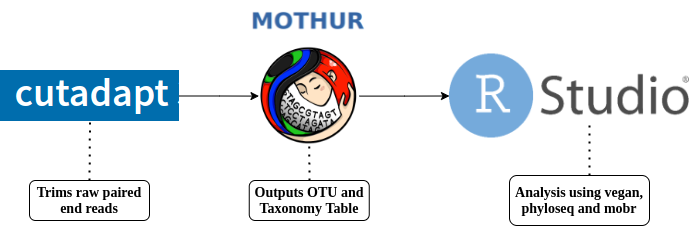

<!DOCTYPE html>
<html>
<head>
<meta charset="utf-8"/>
</head>
<body>
<h1 id="Title">16S Analysis of Invasive and Native Kelp Microbiome</h1>

<h2 id="Objective">Objective</h2>

 The primary objective of this 16S rRNA pipeline is to assess the microbial diversity 
of the biofilms of a native kelp species Laminaria Hyperborea, and an invasive species 
Laminaria Ochroleuca. Through this assessment, we can learn more about how the invasive 
species of kelp may have been successful in its' invasion, through comparison with the 
microbiome of the native species. This was done by 16S rRNA gene sequencing of DNA swabs 
taken from the biofilm of both the stipe and holdfast regions of the thallus of each 
species. 

This was achieved through an inital preprocessing step of primer removal, followed by 
sequence assemblage and quality filtering using the mothur package and the silva 
alignment (release 132) to denoise and classify the full set of reads. The final step 
involves a statistical analysis in Rstudio of the OTU and taxonomy tables created by 
mothur. This workflow can be visualised in the diagram below. 

<h2 id="Project Workflow">Project Workflow</h2>

<h2 id="Programs Used">Programs Used</h2>

<b> **FastQC (v0.11.9)**
 **Cutadapt (v3.4)**
 **Mothur (v1.45.2)** </b>

<h2 id="Scripts">Scripts</h2>

<b> trimprimers.nf:</b> Trims raw paired end reads.
 <b>16Smothur.sh:</b> Sequence alignment and OTU clustering. Silva alignment database needed.
 <b>OTUanalysis.Rmd:</b> Analysis using vegan, phyloseq and mobr.
